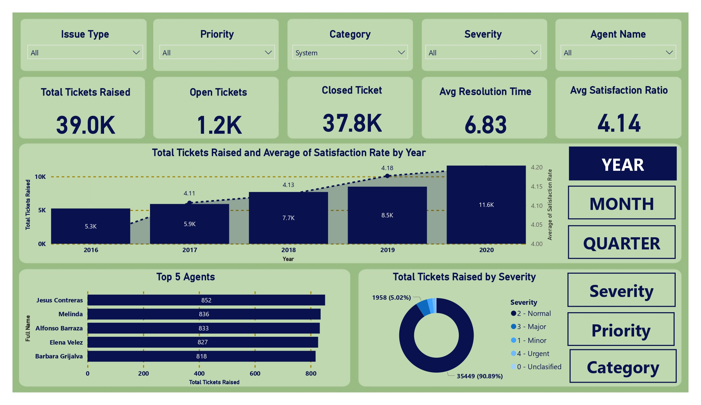
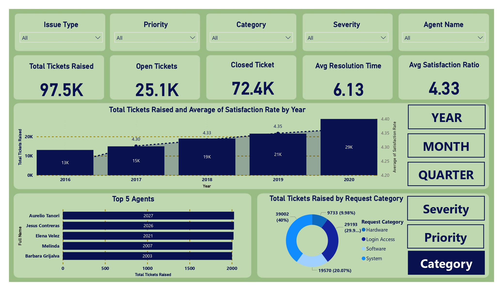

# 🛠️ IT Operations Dashboard

## 🧠 About the Dashboard
The **IT Operations Dashboard** offers a comprehensive overview of ticket management and operational performance. It provides insights into ticket volume, resolution efficiency, agent performance, and satisfaction ratings across multiple categories such as software, hardware, login, and system requests.

---

## 📌 Project Overview
This Power BI dashboard visualizes helpdesk ticket metrics to streamline IT operations and enhance support response strategies.
### 💼 Business Problem

> **"How can IT support teams optimize ticket resolution performance, improve user satisfaction, and manage agent workload effectively?"**

This Power BI dashboard is designed to help IT operations teams monitor and enhance their support process by addressing key challenges:

- 🕒 **Track ticket volume and resolution trends** over time to ensure consistent performance.
- 👥 **Measure agent productivity** by identifying top-performing agents and workload distribution.
- 🚨 **Analyze severity levels** of tickets to prioritize urgent issues and improve incident handling.
- 🗂️ **Understand issue categories** (e.g., Hardware, Software, Login Access) to identify recurring problems and areas needing process improvements.
- 😊 **Evaluate customer satisfaction metrics** and correlate them with resolution efficiency to drive better service outcomes.

By using this dashboard, IT managers can make **data-driven decisions** to streamline operations, enhance team performance, and improve user experience across the organization.

---

## 🛠️ Tools & Technologies
- Power BI Desktop
- Excel / CSV (assumed source format)
- DAX for measures and KPIs

---

## 📈 Key Dashboard Features

1. **Overall Ticket Summary**
   - Total Tickets Raised: 97.5K
   - Open Tickets: 25.1K
   - Closed Tickets: 72.4K
   - Average Resolution Time: 6.13 days
   - Average Satisfaction Rating: 4.33 / 5

2. **Yearly Performance Trends**
   - Highest number of tickets in 2017 (29K)
   - Satisfaction rating increased over time from 4.24 (2016) to 4.36 (2020)

3. **Top Performing Agents**
   - Aurelio Tanori: 2027 tickets
   - Jesus Contreras: 2026 tickets
   - Elena Velez, Melinda, Barbara Grijalva follow closely

4. **Ticket Severity & Priority Analysis**
   - Majority of tickets are “Normal” severity (90.89%)
   - Breakdown of other severities including Major, Minor, and Urgent

5. **Category-Based Ticket Distribution**
   - System: 40%
   - Software: 20.07%
   - Login Access: ~30%
   - Hardware: ~10%

---

## 💡 Insights
- Majority of issues relate to system and login access categories.
- Normal severity tickets dominate the support landscape.
- Ticket resolution time averages slightly above 6 days.
- The top 5 agents manage more than 2,000 tickets each, showing strong team distribution.

---
## 📄 Dashboard

- **Overview**

  

- **Sales Analysis**

  

---

